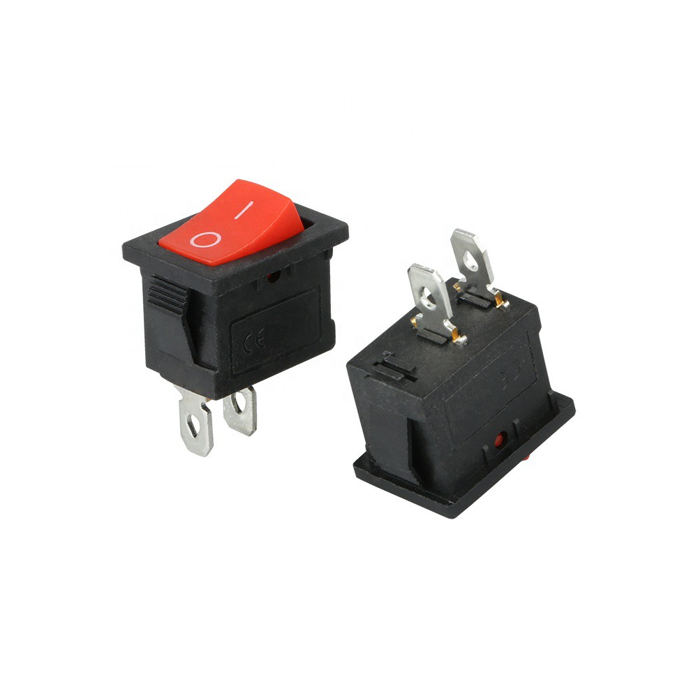
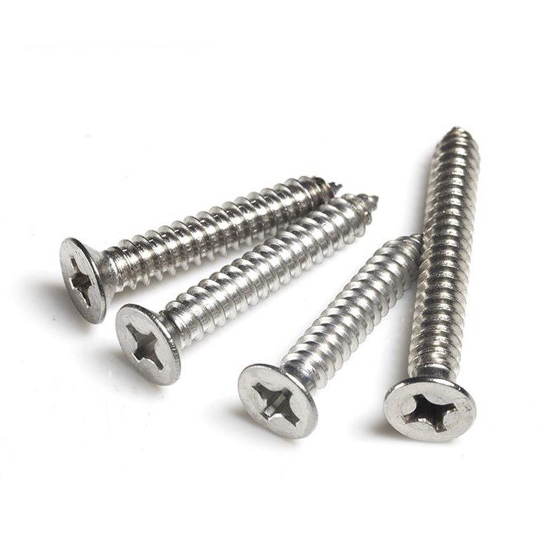

<h1>TempHumidBox</h1>

โจทย์

  
<h1>อุปกรณ์</h1>

Bread Board สำหรับใส่ NodeMCU v.2 (ESP8266)

ขนาด : 46mm. x 35mm.

  

ตัวตรวจวัดอุณหภูมิและความชื้น DHT22

ขนาด : 15.5mm. x 12mm.

    

ชุดเปิด/ปิดไฟ 1 ช่องทาง (1 Ch. Relay Module)

ขนาด : 4.2 x 2.6 x 1.8cm.

      

หลอดไฟแสดงผล (LED) ขนาด 5mm.

ขนาด : 5mm.

  

ปุ่มกด (Push Switch)

ขนาด : 10mm. x 15mm.

          

ขั้วต่อไปเลี้ยงแบบกลม

ขนาด : 3.7 mm.

  

น๊อต M2-M3

ขนาด : M2 1.5mm. และ M3 2.5mm.

<h1>Model Example</h1>

ตัวฝา

  

ตัวกล่อง

  

Detail

ขนาดของฐานล่าง : 77mm. x 90mm.

ขนาดของฝาปิด : 60mm. x 90mm.

ขนาดขอบฝาปิด : 2mm.

ขนาดขอบฐานล่าง : 3mm.

ขนาดของรูขั้วต่อไปเลี้ยงแบบกลม : 5mm.

ขนาดของ Button : 10mm. x 15mm.

ขนาด LED: 5mm.

ขนาดรูต่อไฟ Relay: 8mm. x 18mm.

รูน็อตเชื่อมกล่อง: 1.5mm.

รูน็อตเอาไว้เชื่อมบนฝาผนัง: 1.5mm.

